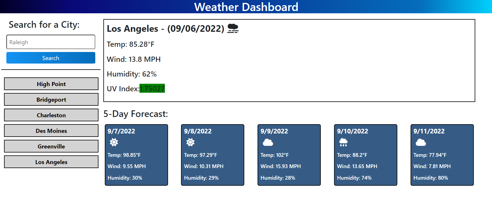

# Weather Dashboard

## About The Project

This website was created to provide you with a Weather Dashboard that displays a city's current weather and weather for the next 5 days. When you input a city name and click on the search button you will be provided with a section that has the city name, date, and an icon that shows the current weather condition. Under the name and date you will also be provided with the current Temperature, Wind Speed, Humidity, and UV Index Value. The background color of the UV Index Value will change depending on the severity of the index value. Underneath the current weather for the city will be another section that displays that city's forecasted weather for the next 5 days. That forecast will display the date, weather specific icon, temperature, wind speed, and humidity. Each search the user makes will display a search history on the left side underneath the city input form and is clickable to get the city's weather information again.

Built With:

- HTML
- CSS
- JavaScript

### Go to the website by clicking the link below!

https://scarelite.github.io/weather-dashboard/

## Here's a preview of the Weather Dashboard!

## Contribution:

Made by Mitchell Armstrong

## Contact

Mitchell Armstrong - email@example.com
